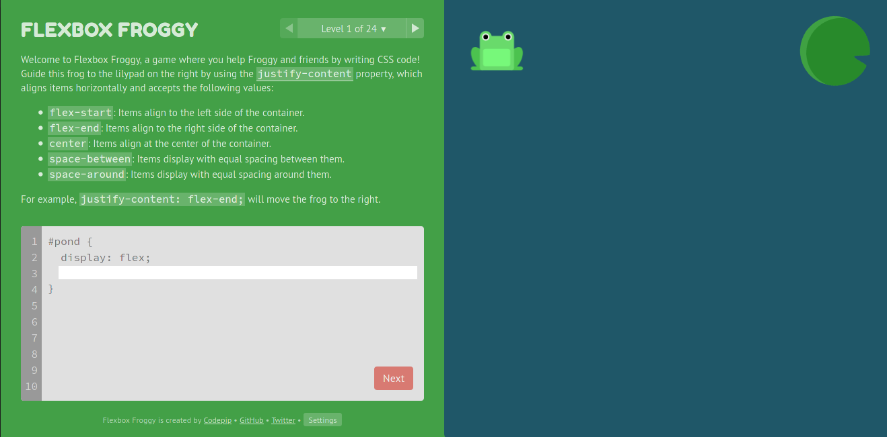
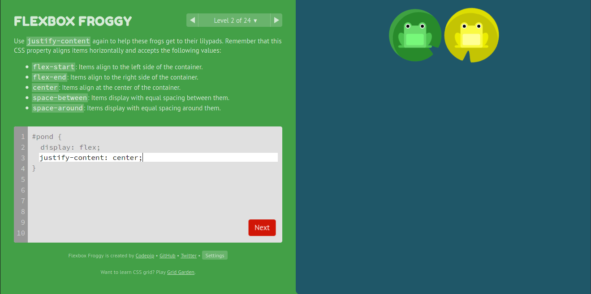
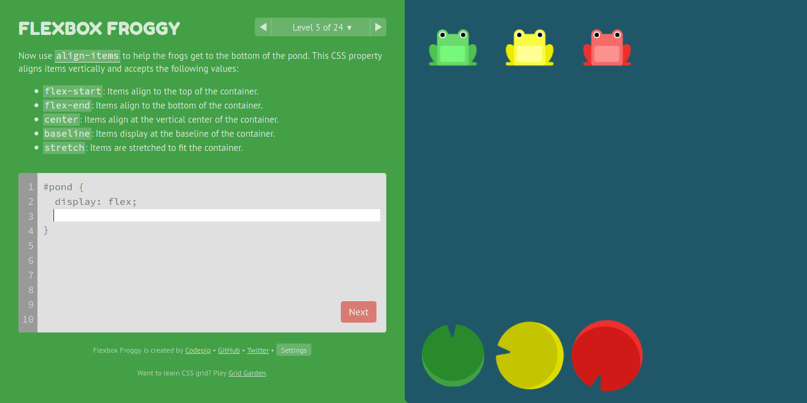
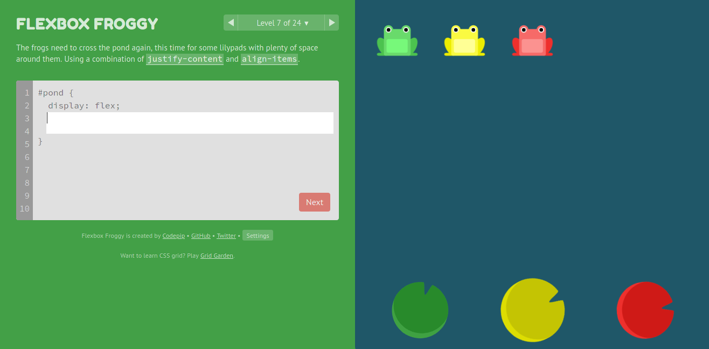
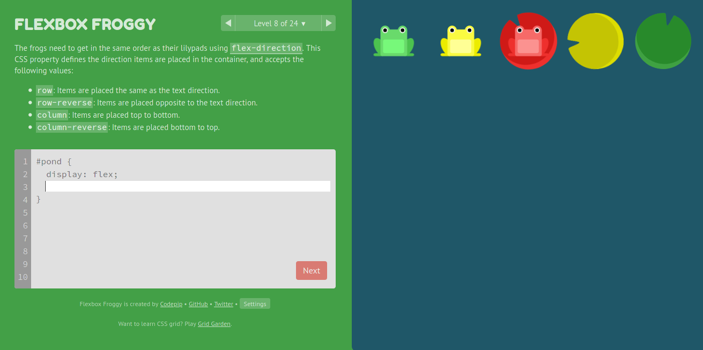
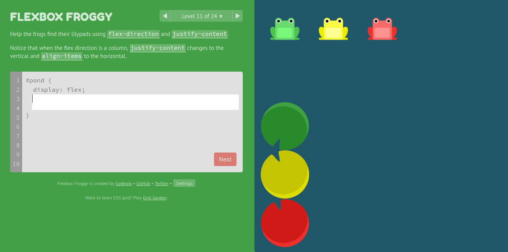
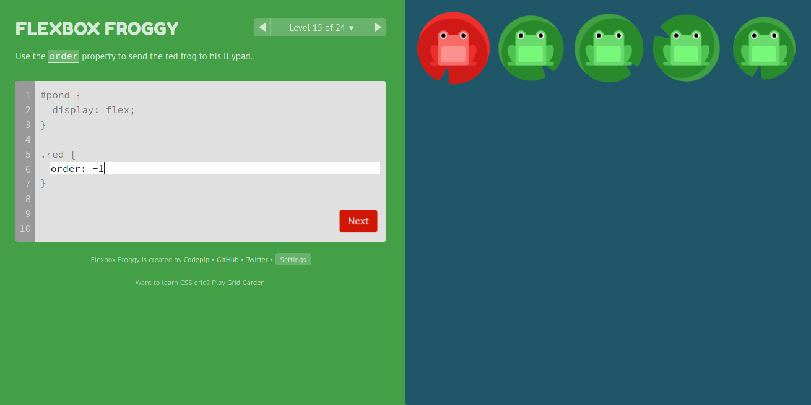
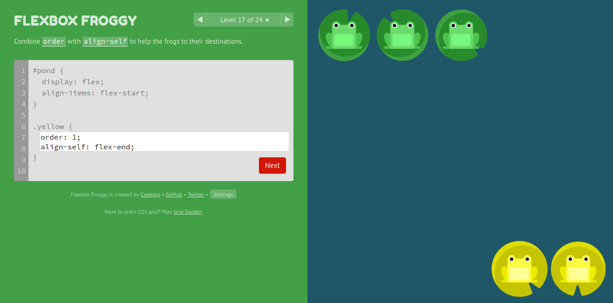
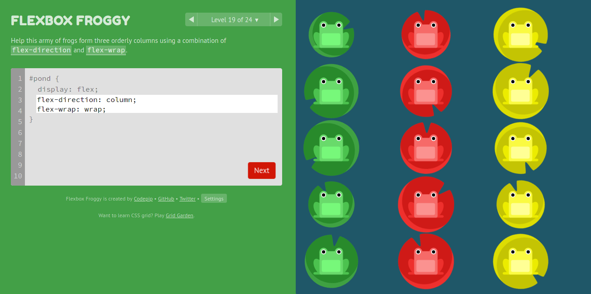
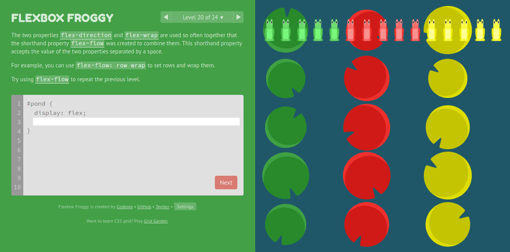

# Flexbox Froggy responses

Here you can find responses to Flexbox Froggy exercises from http://flexboxfroggy.com/.

Also take a look to following resources to learn more about flexbox:

- https://flexbox.malven.co/
- https://jonitrythall.com/content/flexboxsheet.pdf
- https://css-tricks.com/snippets/css/a-guide-to-flexbox/
- https://yoksel.github.io/flex-cheatsheet/
- https://www.digitalocean.com/community/cheatsheets/css-flexbox
- https://www.sketchingwithcss.com/samplechapter/cheatsheet.html
- https://www.freecodecamp.org/news/flexbox-the-ultimate-css-flex-cheatsheet/

# Responses

## Exercise 01

## Exercise 02

## Exercise 03

## Exercise 04

## Exercise 05

## Exercise 06

## Exercise 07

## Exercise 08

## Exercise 09

## Exercise 10

## Exercise 11

## Exercise 12

## Exercise 13

## Exercise 14

## Exercise 15

## Exercise 16

## Exercise 17

## Exercise 18

## Exercise 19

## Exercise 20

## Exercise 21

## Exercise 22

## Exercise 23

## Exercise 24

## Sucess Screen

## :electric_plug: Powered by [XergioAleX](https://www.xergioalex.com/)

## License

This project is [MIT licensed](./LICENSE).
